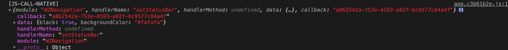
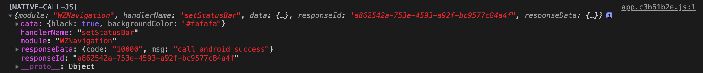

# 常见问题

## 我调用了\*\*方法，没有效果啊？

当项目部署后，在App端打开的时候，经常会遇到各种问题，诸如调用原生的方法并没有起效等等，许多同学不知道该从何处入手进行调试，现在就教给大家如何去甩（背）锅

在[Event](event.md)章节当中，实现了诸多的时间，其中有两个事件在调试的时候是非常有用的，分别为`native-call-js`和`js-call-native`

在项目的入口文件中（若你的项目是Vue项目，则为main文件）加入以下代码

```javascript
import waltz from 'waltz'

if (waltz.os.supportWaltz) {
  waltz.event.on('js-call-native', msg => {
    console.log('[JS-CALL-NATIVE]', msg)
  })
  waltz.event.on('native-call-js', msg => {
    console.log('[NATIVE-CALL-JS]', msg)
  })
}
```

通过使用`Chrome://inspect` 或者`vConsole`进行调试，查看控制台打印的日志，你会看到类似以下的日志。





通过日志可以看到js调用native什么方法，native是否有回调，以及传递的参数等等。

## 我用了Http里面的AxiosHook，我怎么看请求参数和返回参数？

在启用了AxiosHook的情况下，当你的项目运行在App端时，所有的请求都会被拦截，由原生代发，代收。有两种办法可以解决以上问题

### 一、省自己之力，费他人之时

呼叫原生or测试大佬抓包

### 二、自力更生

通过监听`native-call-js`和`js-call-native`事件，在它们的回调当中打印数据

## Uncaught ReferenceError: regeneratorRuntime is not defined

### 解释

在[1.4.0](changelog.md#1-4-0)之前，通过`import`导入的是`.esm.js`文件，babel编译时把`regeneratorRuntime`库打进去，所以会导致这个问题

### 为什么有时候会出现这个问题？

在Vue项目中，如果你在`App.vue中`去使用waltz，就会报这个错，个人猜测是在`App.vue`没有走babel的编译流程，所以也没有`regeneratorRuntime`；在其它.vue文件中调用却是正常，因为Vue项目的babel配置中已经包含了`regeneratorRuntime`

### 如何解决

现提供以下解决方案

* 更新waltz至[1.4.0](changelog.md)版本
* 使用[`script`](./#script)方式导入waltz（不推荐）
* 导入的时候修改为`import waltz from 'waltz/dist/waltz.common.js'`
* 不要在`App.vue`文件中调用waltz


